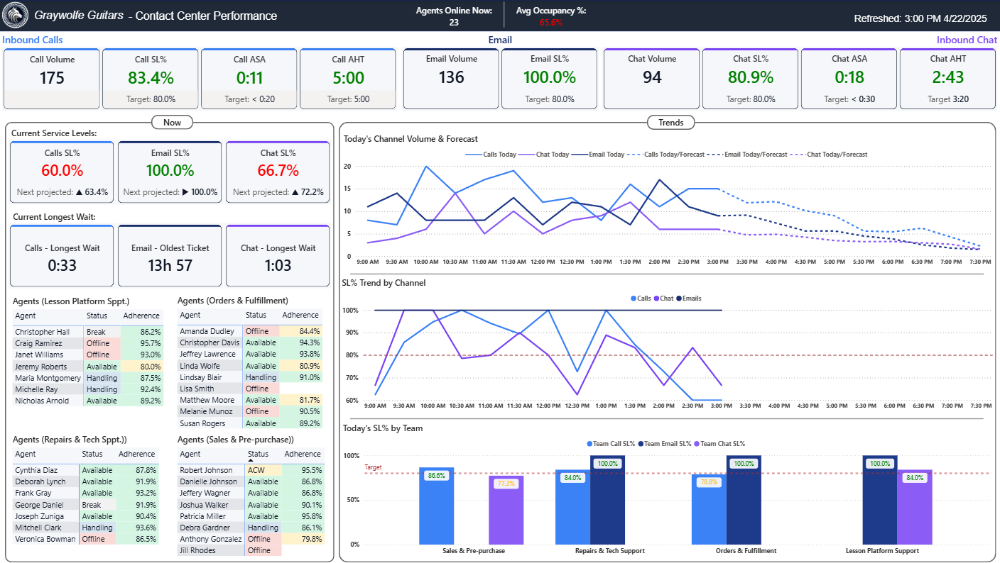
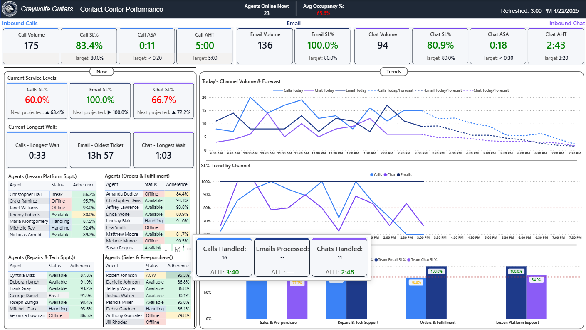
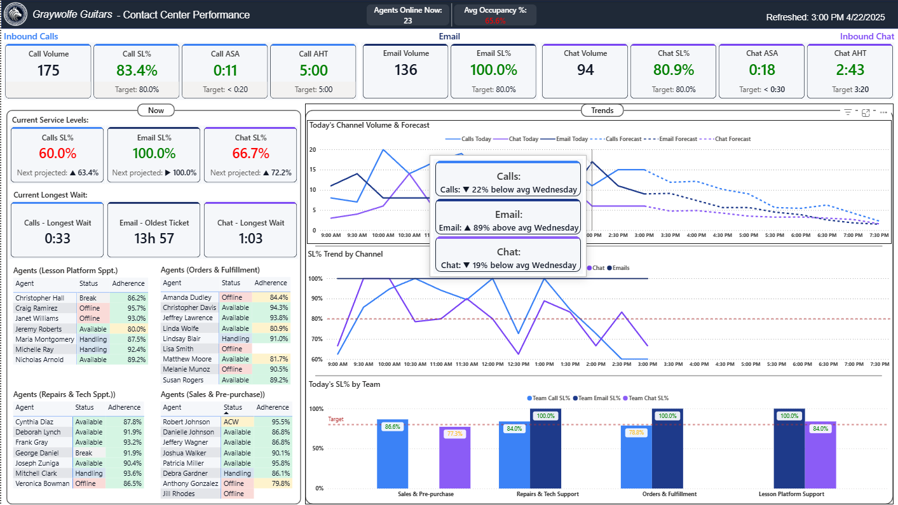
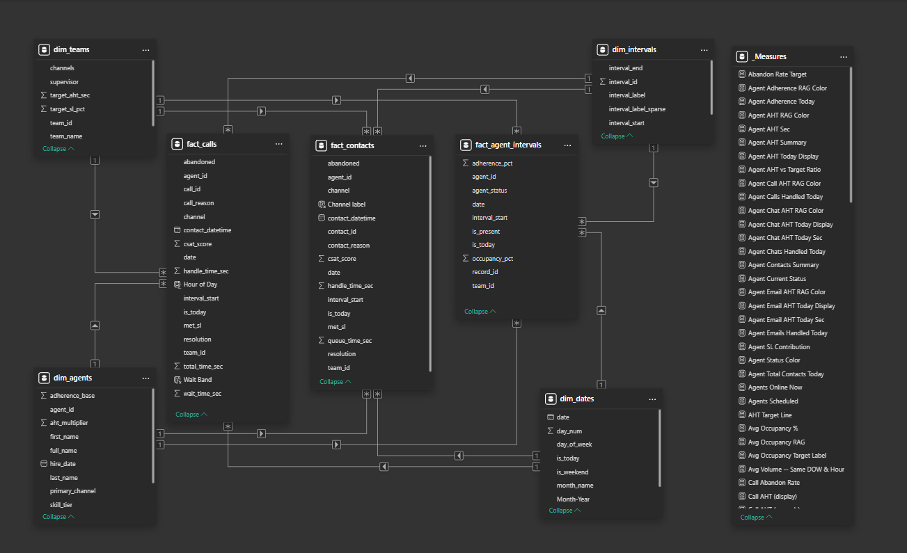

# Graywolfe Guitars — Contact Center Performance Dashboard (Power BI)

## Overview

This project simulates an intraday contact center analytics scenario for a fictional online guitar retailer and lesson platform. It demonstrates how multi-channel support data can be transformed into a real-time, decision-oriented operational dashboard for a contact center manager.

**Core question:**
How are we performing right now across all three contact channels — and where is SLA risk building for the next 30 minutes?

---

## Key Insights (Simulated "today": April 22, 2025 at 3:00 PM)

 - Call SL%: 83.4% — above the 80% target for the day, but the most recent 30-minute interval has dropped to 60%, signaling queue pressure building in the early afternoon
 - Inbound Calls is the most at-risk channel — current interval SL% at 60.0%, projected at 63.4% for the next interval, both below the 80% target
 - Email is healthy — 100% SL% across the day; oldest ticket at 13h 57m, well within the 24-hour threshold
 - Email volume in the early afternoon was 89% above the average Wednesday baseline for that time — a demand spike that may be redirecting agent attention away from calls and chat
 - Overall occupancy at 65.6% — below the 75–85% target band, suggesting a channel distribution problem rather than a headcount shortage
   
**Note:** _Avg. Occupancy here is modeled in the synthetic data rather than calculated from contact and handle time data, because the simulated dataset doesn't capture the per-agent activity logs with quite the same level of detail that a real phone system would provide. The value shown should be statistically realistic, but won't reconcile perfectly with the other metrics on the dashboard._

**Conclusion:**
The operation is not understaffed — it is unbalanced. Chat is absorbing disproportionate SLA risk while email agents have capacity to spare. Immediate reallocation of agents from email to chat, combined with an investigation into the email volume spike, would be the highest-impact interventions available to the manager at this moment.

---

## Dashboard Preview

#### Full Dashboard View

#### Agent Status Matrix - tooltip

#### Today's Channel Volume & Forecast - variance tooltip

---

## Tools Used

 - Power BI: star schema data modeling, DAX measures, conditional formatting, custom tooltip pages
 - Python: synthetic data generation with realistic statistical distributions
   - pandas: DataFrame construction and CSV output across 7 structured files
   - numpy: log-normal AHT distributions, Poisson contact arrival sampling, truncated normal agent skill variation
   - faker: realistic agent name generation

---

## Approach

 - Generated ~67,000 rows of realistic contact center data across 7 CSV files simulating 57 days of multi-channel operations, with a hard intraday cutoff at 3:15 PM on the final day
 - Modeled a star schema with 4 dimension tables and 3 fact tables connected by 12 single-direction relationships in Power BI
 - Built 40+ DAX measures covering service level %, handle time, queue wait time, agent adherence, historical baseline comparison, and next-interval SL% projection
 - Designed a single-page dashboard with 3 analytical zones, each addressing aspects of the core question.
 - Applied channel-coded conditional formatting (RAG status via hex-returning DAX measures) and a solid-to-dashed volume forecast chart showing today's actual volume transitioning to historical Wednesday averages for the remaining hours

#### Model View

